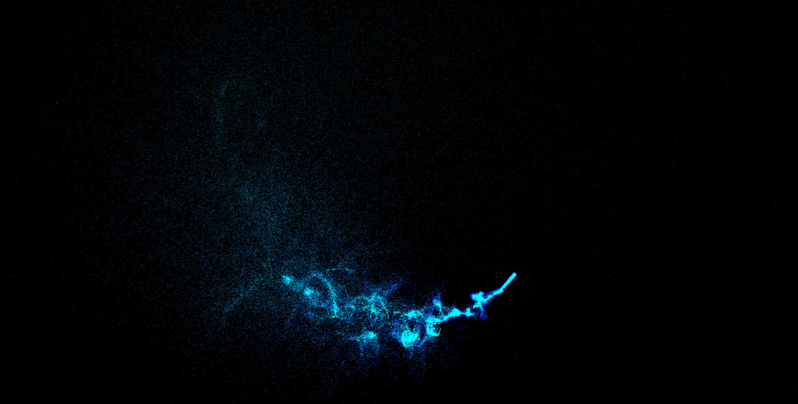

# Particle Cursor ✨

> *Where your cursor leaves a trail of light.*

An interactive particle cursor effect — glowing cyan particles follow and trail the mouse, creating a mesmerizing visual experience on a pure black canvas.

🌐 **Live Demo:** [sujay-kr-samal.github.io/particle_cursor](https://sujay-kr-samal.github.io/particle_cursor/)

---

## 📸 Preview



---

## ✨ Features

- 🖱️ Real-time particle trail following the cursor
- 🔵 Glowing cyan particles on a deep black background
- 💫 Smooth particle fade & dispersion animation
- ⚡ Lightweight — pure HTML, CSS & JavaScript
- 📱 Works on all modern browsers

---

## 🛠️ Tech Stack

| Technology | Usage |
|---|---|
| HTML5 Canvas | Particle rendering |
| CSS3 | Background & styling |
| JavaScript | Particle physics & mouse tracking |

---

## 🚀 Getting Started

```bash
# Clone the repository
git clone https://github.com/sujay-kr-samal/particle_cursor.git

# Navigate into the project
cd particle_cursor

# Open in browser
open index.html
```

---

## 📁 Project Structure

```
particle_cursor/
├── index.html
├── assets/
│   └── preview.png
├── css/
│   └── style.css
└── js/
    └── script.js
```

---

## 🎮 How It Works

1. Move your mouse across the screen
2. Cyan glowing particles spawn at the cursor position
3. Particles drift, disperse, and fade over time
4. Creates a stunning light-trail effect in real time

---

## 👤 Author

**Sujay Kr Samal**
- GitHub: [@sujay-kr-samal](https://github.com/sujay-kr-samal)
- LinkedIn: [Sujay Kr Samal](https://linkedin.com/in/sujay-kr-samal)

---

## 📄 License

This project is open source and available under the [MIT License](LICENSE).

---

<p align="center">Made with 💙 & ✨ by Sujay Kr Samal</p>
